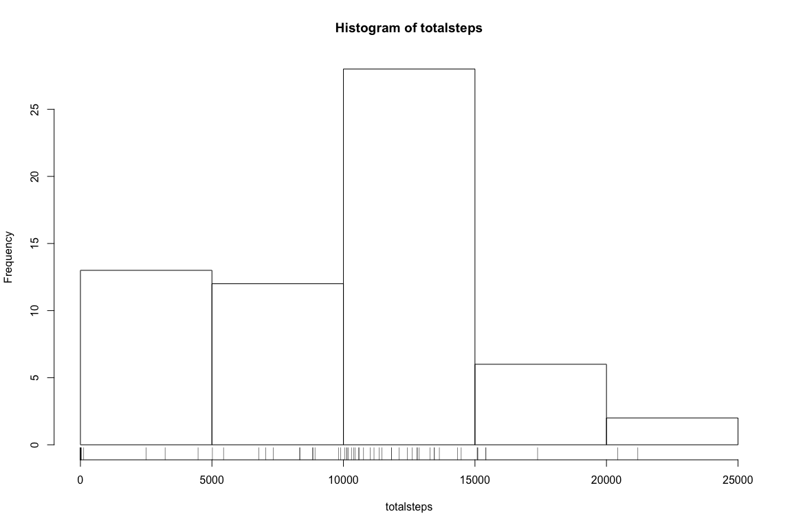
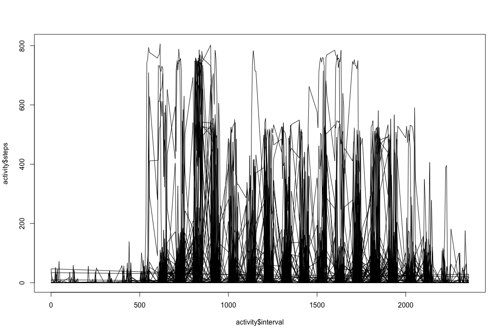
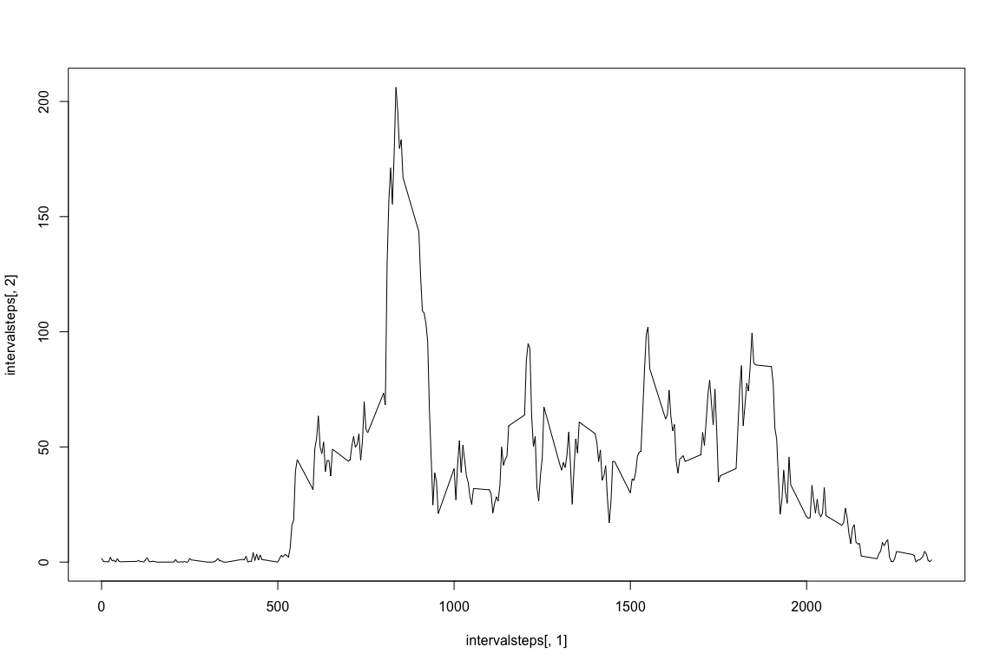
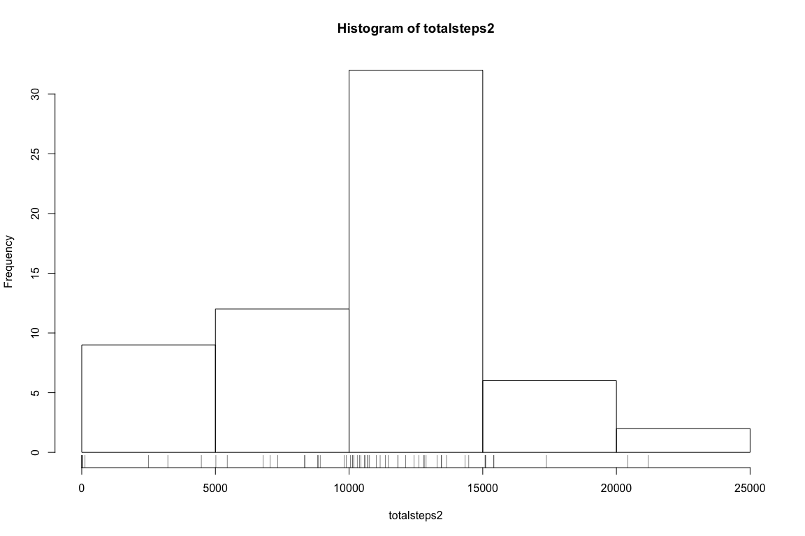
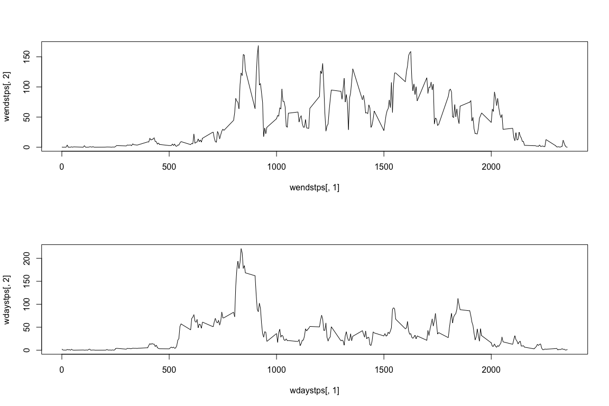

# Reproducible Research: Peer Assessment 1


```r
knitr::opts_chunk$set(fig.width=12, fig.height=8, fig.path='Figs/',
                      results = "markup", echo=TRUE, warning=FALSE,
                message=FALSE)
```

## Initialization
Here we are loading libraries necessary for data analysis and showing the current working directory and files  

```r
library(dplyr)
library(ggplot2)
list.files()
```

```
##  [1] "activity.csv"      "activity.zip"      "assignment.R"     
##  [4] "doc"               "Figs"              "instructions_fig" 
##  [7] "PA1_template.html" "PA1_template.md"   "PA1_template.Rmd" 
## [10] "README.md"
```

```r
getwd()
```

```
## [1] "/Users/bassemghali/Desktop/DataAnalysisMOOC/Course5 reproducibleresearch/Week2"
```

## Loading and preprocessing the data format suitable for your analysis
Here we  1. load the data from the file and  2. convert date strings into date data type:  

```r
activity <- read.csv("activity.csv")
str(activity)
```

```
## 'data.frame':	17568 obs. of  3 variables:
##  $ steps   : int  NA NA NA NA NA NA NA NA NA NA ...
##  $ date    : Factor w/ 61 levels "2012-10-01","2012-10-02",..: 1 1 1 1 1 1 1 1 1 1 ...
##  $ interval: int  0 5 10 15 20 25 30 35 40 45 ...
```

```r
activity$date<- as.Date(as.character(activity$date),"%Y-%m-%d")
```

## What is mean total number of steps taken per day?
Here we take the activity data and for each date, take the total number of steps for that day which is saved in a variable totalsteps.

```r
totalsteps <- tapply(X = activity$steps, INDEX = activity$date, FUN=sum, na.rm=TRUE)
```
We then plot a histogram of the data

```r
par(mfrow = c(1, 1))
hist(totalsteps)
rug(totalsteps)
```

<!-- -->
and provide the summary data of the total daily steps (mean, median)

```r
summary(totalsteps)
```

```
##    Min. 1st Qu.  Median    Mean 3rd Qu.    Max. 
##       0    6778   10400    9354   12810   21190
```

## What is the average daily activity pattern?
We start by plotting a time serpies plot of y=  # steps taken (of particular interval), versus the intervals

```r
plot(activity$interval,activity$steps, type = "l")
```

<!-- -->

Next we split the data, so that we compute the average number of steps for each interval over all days and save this in intervalsteps and find the interval with the most average steps

```r
intervalsteps <- tapply(X = activity$steps, INDEX = activity$interval, FUN=mean, na.rm=TRUE)
intervalsteps<- cbind(as.numeric(names(intervalsteps)),intervalsteps)
intervalsteps[which.max(intervalsteps[,2]),1]
```

```
## [1] 835
```

We finally plot a time serpies plot of y= average # steps taken (of particular interval over all days), versus the intervals

```r
plot(intervalsteps[,1],intervalsteps[,2], type = "l")
```

<!-- -->

## Imputing missing values
We first make a copy of the dataset, called activity2 which we will then fill the missing values in. We also find how many missing values there are.

```r
length(activity$date)
```

```
## [1] 17568
```

```r
sum(is.na(activity$date)|is.na(activity$interval)|is.na(activity$steps))
```

```
## [1] 2304
```

```r
activity2<- activity
```
We will use mean substitution for imputation. We use a for-loop here: for each missing value we   

1) find which interval the missing value is in, then 
2) find what the mean steps for that interval is,  
3) substitute the mean steps for that missing value in the new dataset (activity2). 
At the end, activity 2 will have no missing values.

```r
for (i in 1:length(activity$steps[is.na(activity2$steps)])){
        interval <- activity$interval[is.na(activity2$steps)][i]
        msteps <- intervalsteps[intervalsteps[,1]==interval,2]
        activity2$steps[is.na(activity$steps)][i] <- msteps
}
```

This final section of code now plots a histogram of the imputed steps by interval data, and calcualtes summary data

```r
totalsteps2 <- tapply(X = activity2$steps, INDEX = activity2$date, FUN=sum, na.rm=TRUE)
hist(totalsteps2)
rug(totalsteps2)
```

<!-- -->

```r
summary(totalsteps2)
```

```
##    Min. 1st Qu.  Median    Mean 3rd Qu.    Max. 
##       0    8355   10700   10060   12810   21190
```


## Are there differences in activity patterns between weekdays and weekends?

We first calculate which days of the week data is in using teh weekdays() function, and based on this make a new factor variable which is saved as either weekday or weekend called wday

```r
activity2$day <- weekdays(as.Date(activity2$date,"%Y-%m-%d"))
activity2$wday <- "weekday"
activity2$wday[activity2$day =="Saturday" | activity2$day =="Sunday"] <- "weekend"
```

We then split the dataset by wehtehr it is weekend or weekday into variable x. Each of these are then used to calculate the avaergae steps for each interval over averaged across all weekday days or weekend days, the resultant data is saved in wendstps and wdaystps 

```r
x<-split(activity2,activity2$wday)
wendstps <- tapply(X = x$weekend$steps, INDEX = x$weekend$interval, FUN=mean, na.rm=TRUE)
wendstps<- cbind(as.numeric(names(wendstps)),wendstps)
wdaystps <- tapply(X = x$weekday$steps, INDEX = x$weekday$interval, FUN=mean, na.rm=TRUE)
wdaystps<- cbind(as.numeric(names(wdaystps)),wdaystps)
```
Plot the steps-interval data for weekend and weekdays on seperate panels.

```r
par(mfrow = c(2, 1))
plot(wendstps[,1],wendstps[,2], type = "l")
plot(wdaystps[,1],wdaystps[,2], type = "l")
```

<!-- -->
